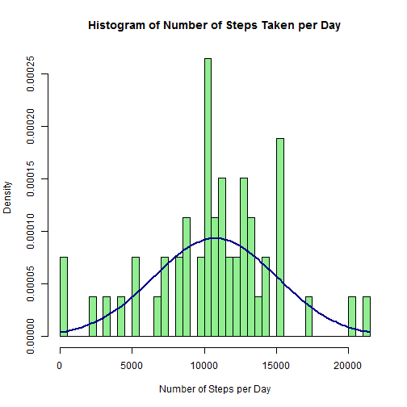
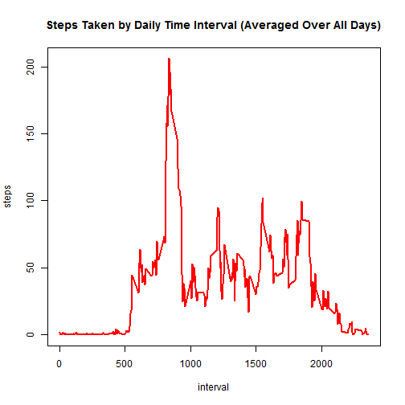
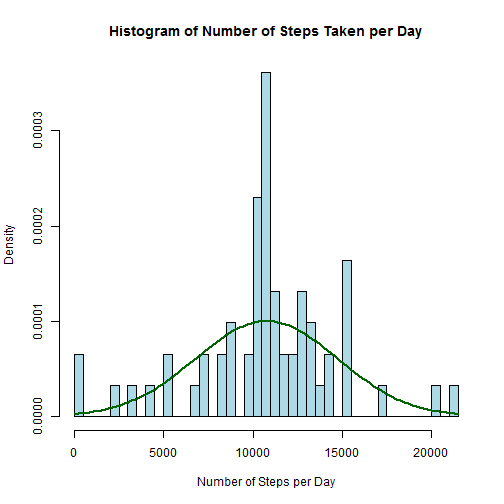
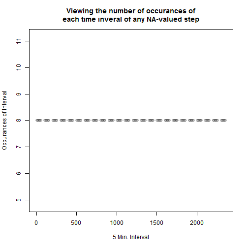
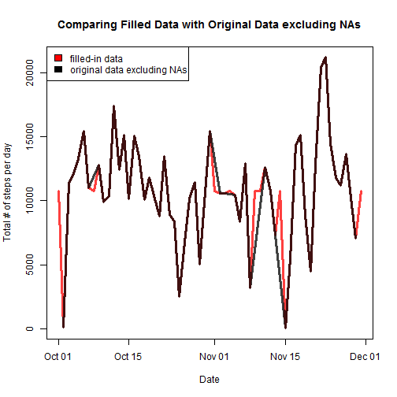
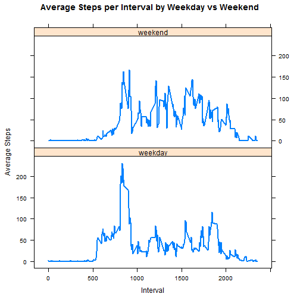
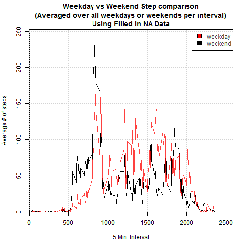

## Analyzing Data from Personal Activity Monitoring Devices (PAMD)
### Coursera Reproducible Research 010: Project 1

For this study, we're using a data set of PAMD data collected at 5 minute intervals from one anonymous individual spanning the months of Octover and November, 2012.  The data collected was the steps taken per 5 minute interval.  
Oiginal data set can be found here: https://d396qusza40orc.cloudfront.net/repdata%2Fdata%2Factivity.zip

-----
### _Loading and preprocessing the data:_


```r
d <- read.csv("activity.csv")
d$date <- as.Date(d$date)
d_noNA <- subset(d, !is.na(d$steps))
```

### _Assessing the mean total steps per day, excluding missing (NA) step counts:_


```r
d_noNA_byday_sumSteps <- aggregate(steps ~ date, d_noNA, FUN="sum")

hist(d_noNA_byday_sumSteps$steps, breaks=length(unique(d_noNA_byday_sumSteps$date)),
     xlab="Number of Steps per Day",
     main="Histogram of Number of Steps Taken per Day",
     col="lightgreen", freq=F)
curve(dnorm(x, mean=mean(d_noNA_byday_sumSteps$steps),
            sd=sd(d_noNA_byday_sumSteps$steps)),
      add=TRUE, col="darkblue", lwd=2)
```

 

```r
mean_steps_per_day <- mean(d_noNA_byday_sumSteps$steps)
median_steps_per_day <- median(d_noNA_byday_sumSteps$steps)
```

* There were an __average__ of 10766.19 steps per day.
* The __median__ steps per day was 10765.

----

### _Assessing the average daily activity pattern:_

```r
d_noNA_bytimeint_meanSteps <- aggregate(steps ~ interval, d_noNA, FUN="mean")

plot(d_noNA_bytimeint_meanSteps, type="l", col="red", lwd=2,
     main="Steps Taken by Daily Time Interval (Averaged Over All Days)")
```

 

```r
interval_of_max_steps <- d_noNA_bytimeint_meanSteps[d_noNA_bytimeint_meanSteps$steps==max(d_noNA_bytimeint_meanSteps$steps),]
```

* The __interval with the highest average steps__ over all days was __835__ with an average of 206.17 steps.

----

### _Analyzing the data with missing (NA) steps replaced by their respective time-interval average_:


```r
na_data <- d[is.na(d$steps) | is.na(d$date) | is.na(d$interval),] # verified only the step column contained NA
num_of_NAs <- length(na_data$steps)
```

* There are a __total of 2304 missing values (NA)__ in the original data set.  
  
The below code takes the original data set and imputs and replaces any NA step value with its respective time-interval average over all days:


```r
# merge mean_steps_bytimeint_meanSteps with D
# then replace NA steps w/ mean step for that time interval

d_merged <- merge(d, d_noNA_bytimeint_meanSteps, by=c("interval"))
attach(d_merged)
d_merged <- d_merged[order(date, interval),]
detach(d_merged)
# steps.x represents the original data steps
# and steps.y represents the average steps over all days per time interval
change_na_fxn <- function(x, y) if(is.na(x)) { x <- y } else {x <- x}
filled_NA_steps <- mapply(change_na_fxn, d_merged$steps.x, d_merged$steps.y)
d$steps <- filled_NA_steps

d_byday_sumSteps <- aggregate(steps ~ date, d, FUN="sum")
hist(d_byday_sumSteps$steps, breaks=length(unique(d_byday_sumSteps$date)),
     xlab="Number of Steps per Day",
     main="Histogram of Number of Steps Taken per Day",
     col="lightblue", freq=F)
curve(dnorm(x, mean=mean(d_byday_sumSteps$steps),
            sd=sd(d_byday_sumSteps$steps)),
      add=TRUE, col="darkgreen", lwd=2)
```

 

```r
mean_steps_per_day_filledNAs <- mean(d_byday_sumSteps$steps)
median_steps_per_day_filledNAs <- median(d_byday_sumSteps$steps)
```

* With the __filled-in data__, there were an __average__ of 10766.19 steps per day.
* The __median__ steps per day was 10766.19 for the __filled-in data__.

* Examining the difference between the filled in data and original NA excluded data, we see the __mean remains the same between the two data sets__, whereas __the median is changed__.  This is likely due to an averaging effect, essentially bringing the median closer and closer to the mean _so long as the NA values are mostly randomly distributed among time intervals_. (If all of the NAs were at time intervals where the average was closer to 0, for example, the median might effectively be 0 and the mean would decrease).

Let's examine whether or not the NA values are indeed spanning the entire range or are isolated to certain intervals:


```r
interval_occurances <- aggregate(date ~ interval + date, na_data, FUN="NROW")
# "date" column" effectively becomes the number of occurances for that interval over the data set
names(interval_occurances) <- c("interval", "occur")
names(interval_occurances)
```

```
## [1] "interval" "occur"
```

```r
interval_occurances$occur  <- as.numeric(interval_occurances$occur)
plot(interval_occurances$interval,interval_occurances$occur, col=rgb(0,0,0,0.25), pch=1,
     type="p", xlab="5 Min. Interval", ylab="Occurances of Interval",
     main="Viewing the number of occurances of\neach time inveral of any NA-valued step")
```

 
  
The above plot simply shows that missing step (NA) values are spread evenly for all time intervals for each day.  This suggests the NA values were missing from an entire day, rather than sporadically through individual days.  This is confirmed by realizing the number of occurences of the above plot for each time interval is 8, which is also the number of days where NA values occured.

```r
unique(na_data$date)
```

```
## [1] "2012-10-01" "2012-10-08" "2012-11-01" "2012-11-04" "2012-11-09"
## [6] "2012-11-10" "2012-11-14" "2012-11-30"
```

Now, since we know the data is not hugely compromised by filling in the NA values with their respective averaged steps per time interval, we can overlay the two data sets to see how they very, if at all:


```r
plot(d_byday_sumSteps$date, d_byday_sumSteps$steps, type="n", lwd=3,
     xlab="Date", ylab="Total # of steps per day", main="Comparing Filled Data with Original Data excluding NAs")
points(d_byday_sumSteps$date, d_byday_sumSteps$steps, type="l", lwd=3,
       col=rgb(1,0,0, 0.75))
points(d_noNA_byday_sumSteps$date, d_noNA_byday_sumSteps$steps, type="l", lwd=3,
       col=rgb(0,0,0,0.75))
legend("topleft", c("filled-in data", "original data excluding NAs"), fill=c("red", "black"))
```

 

In conclusion, when looking at the mean and median values of the steps per day, the difference between the filled-in and original data sets is quite minimal.  However, as viewed in the above plot, if you were to analyze certain days or perhaps specific intervals, a difference between the two data sets would become more apparent.

### _Comparing activity differences between weekdays and weekends:_


```r
# create day of week col (dow)
d$dow <- weekdays(d$date)
# create factor variable that determines if it's a weekend day or not
dow_fxn <- function(x) if(x %in% c("Saturday", "Sunday")) {x <- c("weekend")} else {x <- c("weekday")}
d$dow_fct <- mapply(dow_fxn, d$dow)
d$dow_fct <- factor(d$dow_fct)
# total number of data points from weekday vs weekend:
table(d$dow_fct)
```

```
## 
## weekday weekend 
##   12960    4608
```

```r
# obtain mean steps per time interval over all days
d_bytimeint_meanSteps_filledNAs <- aggregate(steps ~ interval + dow_fct, d, FUN="mean")
a <- d_bytimeint_meanSteps_filledNAs # just for shorter variable name sake
```


```r
xyplot(a$steps ~ a$interval|a$dow_fct, type="l", layout=c(1,2), lwd=2,
       ylab="Average Steps", xlab="Interval",
       main="Average Steps per Interval by Weekday vs Weekend")
```

 

Because I happen to find an overlay plot more useful, I included it here:

```r
# plot weekday average steps vs weekend average steps
plot(a$interval, a$steps, type="n", lwd=3,
     xlab="5 Min. Interval", ylab="Average # of steps",
     main="Weekday vs Weekend Step comparison\n(Averaged over all weekdays or weekends per interval)\nUsing Filled in NA Data",
     xlim=c(0, max(a$interval)*1.1), ylim=c(0,max(a$steps)*1.1), xaxs="i", yaxs="i")
grid(col="lightgrey", lwd=0.5)
points(a[a$dow_fct=="weekday",]$interval, a[a$dow_fct=="weekday",]$steps, type="l", lwd=1.5)
par(col=rgb(1,0,0, 0.75))
points(a[a$dow_fct=="weekend",]$interval, a[a$dow_fct=="weekend",]$steps, type="l", lwd=1.5)
par(col=rgb(0,0,0,0.75))
legend("topright", c("weekday", "weekend"), fill=c("red", "black"))
```

 

Overall, you can see there's __more activity on weekends__ after the morning intervals, and in general, more activity on the weekend as a whole.  However, there is more activity specifically during the morning interval on weekdays.


